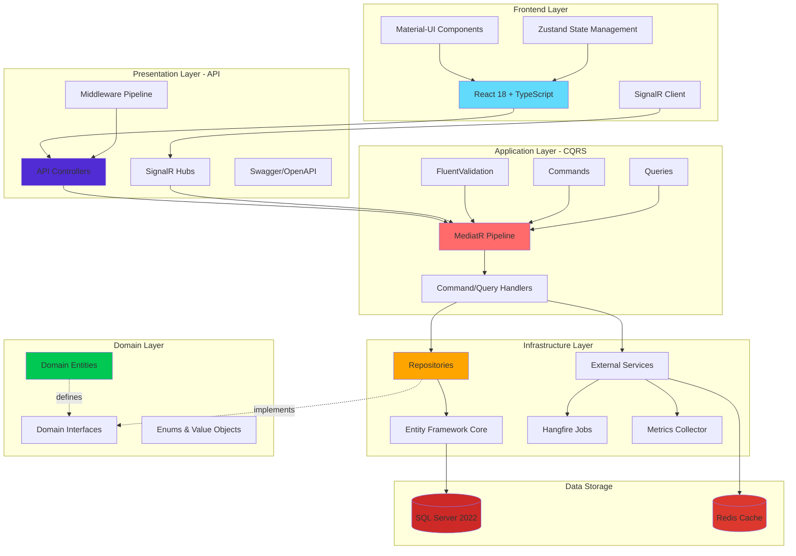
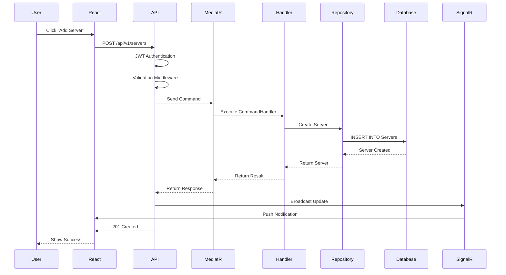
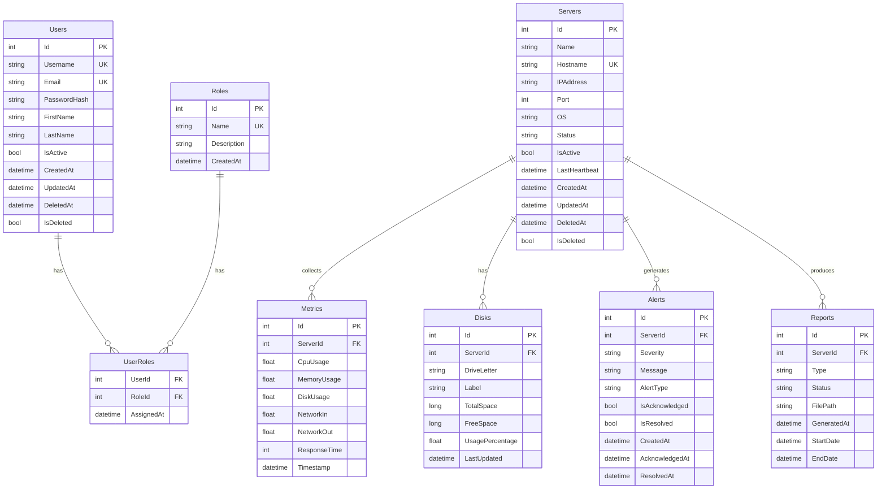
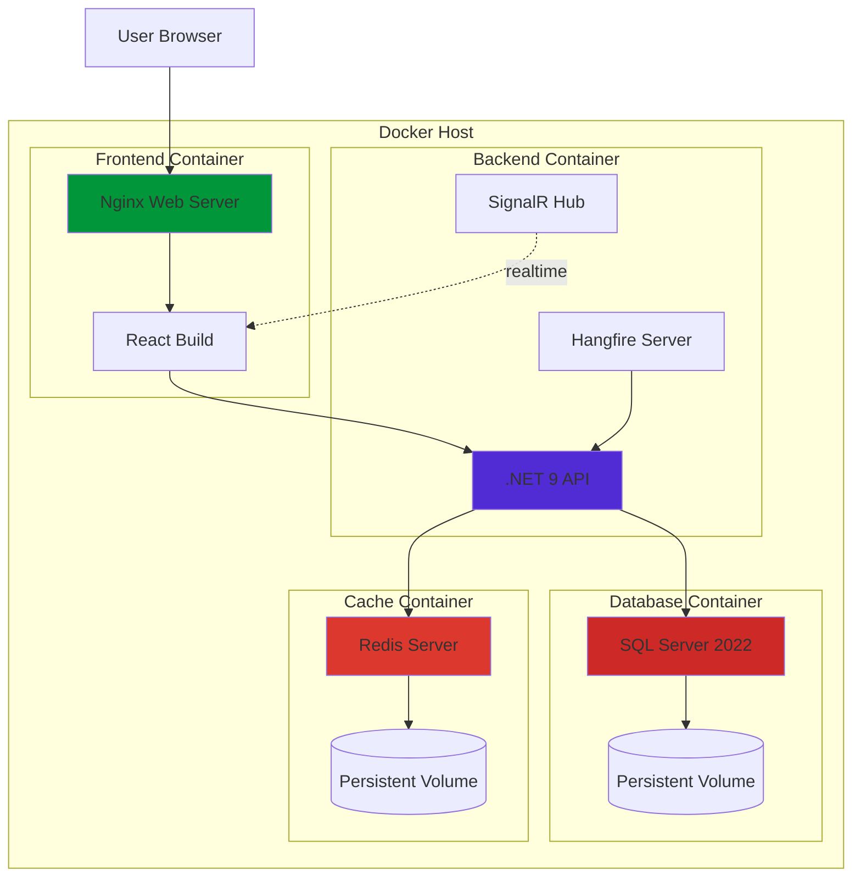
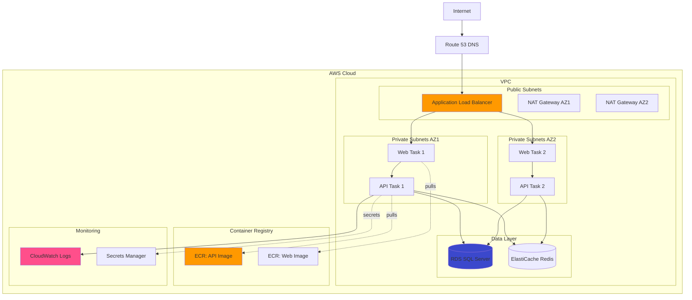

# 🏗️ Architecture Documentation

## Overview

This document provides a comprehensive explanation of the **Server Monitoring System** architecture, demonstrating **Clean Architecture** principles, **SOLID** design principles, and various **Design Patterns** used throughout the application.

---

## 🎨 System Architecture Diagram



---

## 🔄 Request Flow Diagram



---

## 📐 Clean Architecture Implementation

### Layer Hierarchy

```
┌─────────────────────────────────────────┐
│         Presentation Layer              │
│   API Controllers, SignalR Hubs         │  ← Depends on Application
│   src/Presentation/ServerMonitoring.API │
└──────────────┬──────────────────────────┘
               │
┌──────────────▼──────────────────────────┐
│        Application Layer                │
│   CQRS Commands/Queries, Validators     │  ← Depends on Domain
│   src/Application/ServerMonitoring.App  │
└──────────────┬──────────────────────────┘
               │
┌──────────────▼──────────────────────────┐
│      Infrastructure Layer               │
│   EF Core, Repositories, External APIs  │  ← Depends on Domain + Application
│   src/Infrastructure/ServerMonitoring   │
└──────────────┬──────────────────────────┘
               │
┌──────────────▼──────────────────────────┐
│          Domain Layer                   │
│   Entities, Value Objects, Interfaces   │  ← NO Dependencies
│   src/Domain/ServerMonitoring.Domain    │
└─────────────────────────────────────────┘
```

### Dependency Rule

**Rule**: Dependencies only flow inward. Inner layers NEVER depend on outer layers.

- ✅ **Domain**: Zero dependencies - pure business logic
- ✅ **Application**: Depends only on Domain
- ✅ **Infrastructure**: Depends on Domain + Application (implements interfaces)
- ✅ **Presentation**: Depends on Application (uses MediatR, no direct repository access)

---

## 🎯 SOLID Principles Demonstrated

### 1. Single Responsibility Principle (SRP)

**Principle**: Each class should have one reason to change.

#### Example 1: Command Handlers

**File**: [src/Application/ServerMonitoring.Application/Features/Auth/Commands/RegisterUserCommand.cs](../src/Application/ServerMonitoring.Application/Features/Auth/Commands/RegisterUserCommand.cs)

```csharp
// RegisterUserCommand - ONE responsibility: Define registration request
public record RegisterUserCommand : IRequest<AuthResponseDto>
{
    public string Username { get; init; } = string.Empty;
    public string Email { get; init; } = string.Empty;
    public string Password { get; init; } = string.Empty;
}

// RegisterUserCommandHandler - ONE responsibility: Handle user registration
public class RegisterUserCommandHandler : IRequestHandler<RegisterUserCommand, AuthResponseDto>
{
    // Only registration logic - no validation, no HTTP concerns
    public async Task<AuthResponseDto> Handle(RegisterUserCommand request, CancellationToken ct)
    {
        // Registration business logic
    }
}

// RegisterUserCommandValidator - ONE responsibility: Validate registration input
public class RegisterUserCommandValidator : AbstractValidator<RegisterUserCommand>
{
    // Only validation rules
}
```

**Why it matters**: Each class has ONE job. Validation changes don't affect handler logic.

#### Example 2: Repository Pattern

**File**: [src/Infrastructure/ServerMonitoring.Infrastructure/Repositories/ServerRepository.cs](../src/Infrastructure/ServerMonitoring.Infrastructure/Repositories/ServerRepository.cs)

```csharp
// ServerRepository - ONE responsibility: Data access for Server entity
public class ServerRepository : BaseRepository<Server>, IServerRepository
{
    // Only database operations for Server
    // No business logic, no validation, no HTTP concerns
}
```

---

### 2. Open/Closed Principle (OCP)

**Principle**: Open for extension, closed for modification.

#### Example: Base Repository

**File**: [src/Infrastructure/ServerMonitoring.Infrastructure/Repositories/BaseRepository.cs](../src/Infrastructure/ServerMonitoring.Infrastructure/Repositories/BaseRepository.cs)

```csharp
// BaseRepository - CLOSED for modification
public abstract class BaseRepository<T> : IBaseRepository<T> where T : class
{
    protected readonly ApplicationDbContext _context;
    protected readonly DbSet<T> _dbSet;

    // Core CRUD operations - never need to modify
    public virtual async Task<T?> GetByIdAsync(int id) { /* */ }
    public virtual async Task<IEnumerable<T>> GetAllAsync() { /* */ }
    public virtual async Task<T> AddAsync(T entity) { /* */ }
}

// ServerRepository - OPEN for extension
public class ServerRepository : BaseRepository<Server>, IServerRepository
{
    // Extends base functionality with Server-specific queries
    public async Task<IEnumerable<Server>> GetActiveServersAsync()
    {
        return await _dbSet.Where(s => !s.IsDeleted && s.Status == ServerStatus.Up).ToListAsync();
    }
}
```

**Why it matters**: New repository types extend base without modifying it. Zero risk of breaking existing code.

---

### 3. Liskov Substitution Principle (LSP)

**Principle**: Derived classes must be substitutable for their base classes.

#### Example: Repository Substitution

**File**: [src/Domain/ServerMonitoring.Domain/Interfaces/IBaseRepository.cs](../src/Domain/ServerMonitoring.Domain/Interfaces/IBaseRepository.cs)

```csharp
// Any implementation of IServerRepository can substitute for IBaseRepository<Server>
IBaseRepository<Server> repo1 = new ServerRepository(context);  // ✅ Works
IServerRepository repo2 = new ServerRepository(context);        // ✅ Works

// Both maintain the contract:
var server1 = await repo1.GetByIdAsync(1);  // ✅ Returns Server or null
var server2 = await repo2.GetByIdAsync(1);  // ✅ Same behavior
```

**File**: [src/Presentation/ServerMonitoring.API/Controllers/V1/ServersController.cs](../src/Presentation/ServerMonitoring.API/Controllers/V1/ServersController.cs)

```csharp
// Controller doesn't care which implementation - uses abstraction
public class ServersController : ControllerBase
{
    private readonly IServerRepository _repository;  // ← Abstraction, not concrete class
    
    // Works with ANY implementation of IServerRepository
    public ServersController(IServerRepository repository)
    {
        _repository = repository;
    }
}
```

---

### 4. Interface Segregation Principle (ISP)

**Principle**: Clients shouldn't depend on interfaces they don't use.

#### Example: Focused Interfaces

**File**: [src/Domain/ServerMonitoring.Domain/Interfaces/](../src/Domain/ServerMonitoring.Domain/Interfaces/)

```csharp
// ❌ BAD: Fat interface (violates ISP)
public interface IRepository
{
    Task<Server> GetServerAsync(int id);
    Task<User> GetUserAsync(int id);
    Task<Metric> GetMetricAsync(int id);
    // 50 more methods...
}

// ✅ GOOD: Segregated interfaces (follows ISP)
public interface IServerRepository : IBaseRepository<Server>
{
    Task<IEnumerable<Server>> GetActiveServersAsync();
    Task<Server?> GetByIpAddressAsync(string ip);
}

public interface IUserRepository : IBaseRepository<User>
{
    Task<User?> GetByUsernameAsync(string username);
    Task<User?> GetByEmailAsync(string email);
}

public interface IMetricRepository : IBaseRepository<Metric>
{
    Task<IEnumerable<Metric>> GetServerMetricsAsync(int serverId, DateTime from, DateTime to);
}
```

**Why it matters**: ServerRepository doesn't need User methods. Each repository has only relevant methods.

---

### 5. Dependency Inversion Principle (DIP)

**Principle**: Depend on abstractions, not concretions.

#### Example: Dependency Injection

**File**: [src/Presentation/ServerMonitoring.API/Program.cs](../src/Presentation/ServerMonitoring.API/Program.cs)

```csharp
// ❌ BAD: Depends on concrete class (violates DIP)
public class ServersController
{
    private readonly ServerRepository _repository;  // ← Concrete class
    
    public ServersController()
    {
        _repository = new ServerRepository();  // ← Tight coupling
    }
}

// ✅ GOOD: Depends on abstraction (follows DIP)
public class ServersController
{
    private readonly IServerRepository _repository;  // ← Interface
    
    public ServersController(IServerRepository repository)
    {
        _repository = repository;  // ← Injected, loose coupling
    }
}
```

**Configuration**:

```csharp
// Infrastructure layer registration
builder.Services.AddScoped<IServerRepository, ServerRepository>();
builder.Services.AddScoped<IUserRepository, UserRepository>();

// High-level module (Controller) depends on abstraction (IServerRepository)
// Low-level module (ServerRepository) also depends on abstraction
// Abstraction (IServerRepository) defined in Domain - doesn't depend on anything
```

---

## 🎨 Design Patterns Used

### 1. Repository Pattern

**Purpose**: Abstraction over data access logic.

**Location**: [src/Infrastructure/ServerMonitoring.Infrastructure/Repositories/](../src/Infrastructure/ServerMonitoring.Infrastructure/Repositories/)

**Implementation**:

```csharp
// Interface in Domain layer (abstraction)
public interface IServerRepository : IBaseRepository<Server>
{
    Task<IEnumerable<Server>> GetActiveServersAsync();
}

// Implementation in Infrastructure layer
public class ServerRepository : BaseRepository<Server>, IServerRepository
{
    public async Task<IEnumerable<Server>> GetActiveServersAsync()
    {
        return await _dbSet.Where(s => !s.IsDeleted && s.Status == ServerStatus.Up).ToListAsync();
    }
}

// Usage in Application layer (CQRS Query Handler)
public class GetServersQueryHandler
{
    private readonly IServerRepository _repository;  // ← Uses abstraction
    
    public async Task<IEnumerable<ServerDto>> Handle(GetServersQuery request)
    {
        var servers = await _repository.GetActiveServersAsync();
        return _mapper.Map<IEnumerable<ServerDto>>(servers);
    }
}
```

**Benefits**:
- ✅ Testable (mock IServerRepository)
- ✅ Swappable (change DB without changing business logic)
- ✅ Centralized data access logic

---

### 2. CQRS Pattern (Command Query Responsibility Segregation)

**Purpose**: Separate read operations (queries) from write operations (commands).

**Location**: [src/Application/ServerMonitoring.Application/Features/](../src/Application/ServerMonitoring.Application/Features/)

**Implementation**:

```csharp
// COMMAND (Write) - Changes state
public record CreateServerCommand : IRequest<ServerDto>
{
    public string Name { get; init; }
    public string IpAddress { get; init; }
}

public class CreateServerCommandHandler : IRequestHandler<CreateServerCommand, ServerDto>
{
    public async Task<ServerDto> Handle(CreateServerCommand request, CancellationToken ct)
    {
        var server = new Server { Name = request.Name, IpAddress = request.IpAddress };
        await _repository.AddAsync(server);
        await _unitOfWork.SaveChangesAsync(ct);
        return _mapper.Map<ServerDto>(server);
    }
}

// QUERY (Read) - Doesn't change state
public record GetServersQuery : IRequest<IEnumerable<ServerDto>>;

public class GetServersQueryHandler : IRequestHandler<GetServersQuery, IEnumerable<ServerDto>>
{
    public async Task<IEnumerable<ServerDto>> Handle(GetServersQuery request, CancellationToken ct)
    {
        var servers = await _repository.GetAllAsync();
        return _mapper.Map<IEnumerable<ServerDto>>(servers);
    }
}
```

**Usage in Controller**:

```csharp
[HttpPost]
public async Task<ActionResult<ServerDto>> Create([FromBody] CreateServerCommand command)
{
    return Ok(await _mediator.Send(command));  // ← Command
}

[HttpGet]
public async Task<ActionResult<IEnumerable<ServerDto>>> GetAll()
{
    return Ok(await _mediator.Send(new GetServersQuery()));  // ← Query
}
```

---

### 3. Mediator Pattern

**Purpose**: Reduce coupling between components by centralizing request handling.

**Location**: MediatR library used throughout Application layer

**Implementation**:

**File**: [src/Application/ServerMonitoring.Application/DependencyInjection.cs](../src/Application/ServerMonitoring.Application/DependencyInjection.cs)

```csharp
services.AddMediatR(cfg => cfg.RegisterServicesFromAssembly(Assembly.GetExecutingAssembly()));
```

**Benefits**:
- ✅ Controllers don't depend on repositories directly
- ✅ Handlers are independently testable
- ✅ Easy to add pipeline behaviors (logging, validation)

---

### 4. Unit of Work Pattern

**Purpose**: Coordinate multiple repository operations in a single transaction.

**Location**: [src/Domain/ServerMonitoring.Domain/Interfaces/IUnitOfWork.cs](../src/Domain/ServerMonitoring.Domain/Interfaces/IUnitOfWork.cs)

**Implementation**:

```csharp
public interface IUnitOfWork : IDisposable
{
    IServerRepository Servers { get; }
    IMetricRepository Metrics { get; }
    IAlertRepository Alerts { get; }
    Task<int> SaveChangesAsync(CancellationToken cancellationToken = default);
    Task BeginTransactionAsync();
    Task CommitAsync();
    Task RollbackAsync();
}

// Usage
using (var transaction = await _unitOfWork.BeginTransactionAsync())
{
    try
    {
        await _unitOfWork.Servers.AddAsync(server);
        await _unitOfWork.Metrics.AddAsync(metric);
        await _unitOfWork.SaveChangesAsync();
        await transaction.CommitAsync();
    }
    catch
    {
        await transaction.RollbackAsync();
        throw;
    }
}
```

---

### 5. Strategy Pattern

**Purpose**: Define family of algorithms, encapsulate each one, make them interchangeable.

**Location**: [src/Infrastructure/ServerMonitoring.Infrastructure/Services/ResilientMetricsCollector.cs](../src/Infrastructure/ServerMonitoring.Infrastructure/Services/ResilientMetricsCollector.cs)

**Implementation**:

```csharp
// Different metrics collection strategies
public interface IMetricsCollectionStrategy
{
    Task<double> CollectAsync(Server server);
}

public class CpuMetricsStrategy : IMetricsCollectionStrategy
{
    public async Task<double> CollectAsync(Server server)
    {
        // Windows PerformanceCounter for CPU
        using var counter = new PerformanceCounter("Processor", "% Processor Time", "_Total");
        return counter.NextValue();
    }
}

public class MemoryMetricsStrategy : IMetricsCollectionStrategy
{
    public async Task<double> CollectAsync(Server server)
    {
        // Memory collection strategy
    }
}

// Context that uses strategy
public class MetricsCollector
{
    private readonly IMetricsCollectionStrategy _strategy;
    
    public MetricsCollector(IMetricsCollectionStrategy strategy)
    {
        _strategy = strategy;
    }
    
    public async Task<double> Collect(Server server)
    {
        return await _strategy.CollectAsync(server);
    }
}
```

---

### 6. Observer Pattern

**Purpose**: Notify multiple objects about state changes.

**Location**: [src/Presentation/ServerMonitoring.API/Hubs/MonitoringHub.cs](../src/Presentation/ServerMonitoring.API/Hubs/MonitoringHub.cs)

**Implementation** (SignalR):

```csharp
// Hub (Subject)
public class MonitoringHub : Hub
{
    public async Task NotifyMetricUpdate(MetricDto metric)
    {
        // Notify all observers (connected clients)
        await Clients.All.SendAsync("MetricUpdated", metric);
    }
    
    public async Task NotifyServerStatus(int serverId, string status)
    {
        await Clients.All.SendAsync("ServerStatusChanged", serverId, status);
    }
}

// Observer (JavaScript client)
connection.on("MetricUpdated", (metric) => {
    // React to metric update
    updateDashboard(metric);
});
```

---

### 7. Decorator Pattern

**Purpose**: Add behavior to objects dynamically without modifying their structure.

**Location**: [src/Presentation/ServerMonitoring.API/Middleware/](../src/Presentation/ServerMonitoring.API/Middleware/)

**Implementation**:

```csharp
// Base behavior
app.UseRouting();

// Decorated with authentication
app.UseAuthentication();

// Decorated with authorization
app.UseAuthorization();

// Decorated with correlation ID tracking
app.UseMiddleware<CorrelationIdMiddleware>();

// Decorated with idempotency
app.UseMiddleware<IdempotencyMiddleware>();

// Final endpoint
app.MapControllers();
```

Each middleware decorates the request pipeline with additional behavior.

---

### 8. Factory Pattern

**Purpose**: Create objects without specifying exact class.

**Location**: Background job creation

**Implementation**:

```csharp
public interface IBackgroundJobFactory
{
    IBackgroundJob CreateJob(JobType type);
}

public class BackgroundJobFactory : IBackgroundJobFactory
{
    public IBackgroundJob CreateJob(JobType type)
    {
        return type switch
        {
            JobType.MetricsCollection => new MetricsCollectionJob(),
            JobType.AlertProcessing => new AlertProcessingJob(),
            JobType.ReportGeneration => new ReportGenerationJob(),
            _ => throw new ArgumentException("Unknown job type")
        };
    }
}
```

---

## 🔄 Request Flow Example

### Creating a Server (Write Operation)

```
1. Client → POST /api/v1/servers (HTTP Request)
                ↓
2. ServersController.Create(CreateServerCommand)
                ↓
3. MediatR.Send(CreateServerCommand)
                ↓
4. CreateServerCommandValidator.Validate()  ← FluentValidation
                ↓
5. CreateServerCommandHandler.Handle()
                ↓
6. IServerRepository.AddAsync(server)  ← Repository
                ↓
7. ApplicationDbContext.SaveChangesAsync()  ← EF Core
                ↓
8. AuditInterceptor.SavingChanges()  ← Set CreatedAt
                ↓
9. Database.Insert(Server)  ← SQL Server
                ↓
10. AutoMapper.Map<ServerDto>(server)
                ↓
11. MonitoringHub.NotifyServerCreated()  ← SignalR
                ↓
12. Response → 201 Created with ServerDto
```

---

## 🧪 Testability

### Unit Testing Example

```csharp
[Fact]
public async Task Handle_WithValidServer_ShouldCreateServer()
{
    // Arrange
    var mockRepo = new Mock<IServerRepository>();
    var mockMapper = new Mock<IMapper>();
    var handler = new CreateServerCommandHandler(mockRepo.Object, mockMapper.Object);
    
    var command = new CreateServerCommand { Name = "Test Server", IpAddress = "192.168.1.1" };
    
    // Act
    var result = await handler.Handle(command, CancellationToken.None);
    
    // Assert
    mockRepo.Verify(r => r.AddAsync(It.IsAny<Server>()), Times.Once);
}
```

**Why testable?**
- ✅ Dependencies are interfaces (easily mocked)
- ✅ No static methods
- ✅ No direct database calls
- ✅ Single responsibility makes tests focused

---

## 📊 Database Design

### Entity Relationship Diagram



### Relationship Details

| Relationship | Type | Description |
|--------------|------|-------------|
| **Users ↔ Roles** | Many-to-Many | Users can have multiple roles (Admin, User) |
| **Servers → Metrics** | One-to-Many | Each server has multiple metric snapshots |
| **Servers → Disks** | One-to-Many | Each server has multiple disk drives |
| **Servers → Alerts** | One-to-Many | Each server generates multiple alerts |
| **Servers → Reports** | One-to-Many | Each server has multiple generated reports |

### Soft Delete Implementation

**File**: [src/Infrastructure/ServerMonitoring.Infrastructure/ApplicationDbContext.cs](../src/Infrastructure/ServerMonitoring.Infrastructure/ApplicationDbContext.cs)

```csharp
// Global query filter for soft delete
modelBuilder.Entity<Server>().HasQueryFilter(s => !s.IsDeleted);
modelBuilder.Entity<User>().HasQueryFilter(u => !u.IsDeleted);

// Automatic soft delete in SaveChanges
foreach (var entry in ChangeTracker.Entries<ISoftDelete>())
{
    if (entry.State == EntityState.Deleted)
    {
        entry.State = EntityState.Modified;
        entry.Entity.IsDeleted = true;
        entry.Entity.DeletedAt = DateTime.UtcNow;
    }
}
```

---

## 🔐 Security Architecture

### JWT Authentication Flow

```
1. Client → POST /api/v1/auth/login { username, password }
                ↓
2. Hash password with PBKDF2 (100,000 iterations)
                ↓
3. Verify against stored hash
                ↓
4. Generate JWT (60 min) + Refresh Token (7 days)
                ↓
5. Return tokens
                ↓
6. Client stores tokens
                ↓
7. Client → GET /api/v1/servers
              Header: Authorization: Bearer {token}
                ↓
8. JwtBearerMiddleware validates token
                ↓
9. Set HttpContext.User
                ↓
10. [Authorize] attribute checks claims
                ↓
11. Process request
```

---

## 🚀 Performance Optimizations

### 1. Async/Await Throughout

All I/O operations use async/await to avoid thread blocking.

### 2. Cursor Pagination (v2 API)

**File**: [src/Application/ServerMonitoring.Application/Features/Servers/Queries/GetServersCursorQuery.cs](../src/Application/ServerMonitoring.Application/Features/Servers/Queries/GetServersCursorQuery.cs)

```csharp
// Efficient pagination for large datasets
public async Task<CursorPagedResult<ServerDto>> Handle(GetServersCursorQuery request)
{
    var query = _context.Servers.Where(s => s.Id > request.Cursor);
    var servers = await query.Take(request.PageSize + 1).ToListAsync();
    
    var hasMore = servers.Count > request.PageSize;
    var items = servers.Take(request.PageSize).ToList();
    var nextCursor = hasMore ? items.Last().Id : (int?)null;
    
    return new CursorPagedResult<ServerDto>(items, nextCursor, hasMore);
}
```

### 3. Caching Strategy

```csharp
services.AddStackExchangeRedisCache(options =>
{
    options.Configuration = configuration["Redis:ConnectionString"];
});

// Cache frequently accessed data
await _cache.SetStringAsync($"server:{id}", json, new DistributedCacheEntryOptions
{
    AbsoluteExpirationRelativeToNow = TimeSpan.FromMinutes(5)
});
```

### 4. Database Indexing

```csharp
modelBuilder.Entity<Server>()
    .HasIndex(s => s.IpAddress);

modelBuilder.Entity<User>()
    .HasIndex(u => u.Username)
    .IsUnique();

modelBuilder.Entity<Metric>()
    .HasIndex(m => new { m.ServerId, m.Timestamp });
```

---

## � Deployment Architecture

### Docker Compose Stack



### AWS ECS Fargate Architecture



### Deployment Options Comparison

| Feature | Docker Compose | Docker Swarm | AWS ECS Fargate |
|---------|----------------|--------------|-----------------|
| **Setup Time** | 5 minutes | 15 minutes | 30 minutes |
| **Cost** | Free (local) | Infrastructure only | ~$80-280/month |
| **High Availability** | ❌ Single host | ✅ Multi-node | ✅ Multi-AZ |
| **Auto-scaling** | ❌ Manual | ⚠️ Limited | ✅ Automatic |
| **Load Balancing** | ❌ None | ✅ Built-in | ✅ ALB |
| **Monitoring** | ⚠️ Docker logs | ⚠️ Prometheus | ✅ CloudWatch |
| **Secrets Management** | ⚠️ Environment vars | ✅ Docker secrets | ✅ Secrets Manager |
| **Use Case** | Development | Self-hosted prod | Cloud production |

---

## �📝 Summary

This architecture demonstrates:

✅ **Clean Architecture** - Clear layer separation, dependency rule enforced
✅ **SOLID Principles** - Every principle shown with real code examples
✅ **Design Patterns** - 8+ patterns implemented correctly
✅ **Testability** - All components easily mockable and testable
✅ **Maintainability** - Changes isolated to specific layers
✅ **Scalability** - Async operations, caching, efficient queries
✅ **Security** - JWT, password hashing, authorization policies

**This is production-grade enterprise architecture designed for long-term maintainability and team collaboration.**
